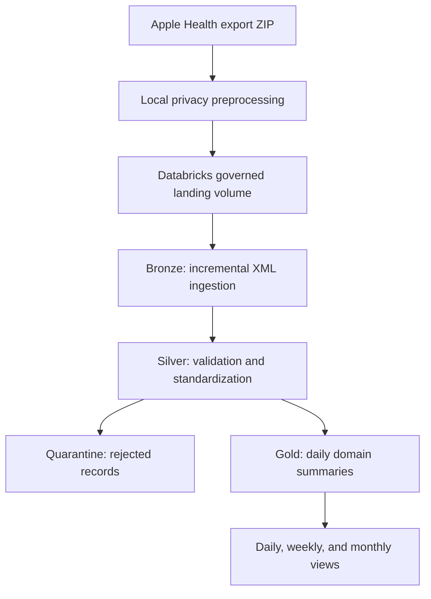

# Apple Health Analytics Lakehouse

A privacy-aware data engineering pipeline that transforms a semi-structured Apple Health XML export into governed, analytics-ready Delta tables and reusable daily, weekly, and monthly views in Databricks.

## Project Overview

Apple Health exports contain deeply nested XML, device and source metadata, sensitive record families, mixed data types, inconsistent measurement units, and overlapping observations. This project addresses those challenges with an end-to-end batch lakehouse pipeline built around privacy protection, incremental ingestion, deterministic processing, record-level validation, dimensional aggregation, and reusable analytics.

The processed dataset contains more than **225,000 measurements** across **14 retained health metric types** and **1,095 privacy-protected calendar dates**. Original dates and direct identifiers are not published.

## Architecture



## Engineering Highlights

- Processes Apple Health XML with Databricks Auto Loader and Spark Structured Streaming.
- Uses schema tracking, rescued-data capture, checkpoints, and an available-now trigger for repeatable batch ingestion.
- Generates SHA-256 source and record identifiers for lineage, deduplication, and idempotent processing.
- Normalizes timestamps to UTC and converts measurement units into analytics-friendly canonical units.
- Applies explicit validation rules and routes rejected records to a dedicated Delta quarantine table.
- Uses Delta Lake `MERGE` operations to support safe reruns without inserting duplicate records.
- Builds activity, mobility, hearing, and sleep Gold tables at a daily analytical grain.
- Creates reusable daily-trend, weekly-summary, and monthly-summary SQL views.
- Protects the source outside Databricks before it enters the cloud workspace.

## Privacy Design

The original Apple Health export is never committed to this repository.

The preprocessing script performs the following operations before cloud ingestion:

- Removes the personal profile, device attributes, nested metadata, and clinical-document content.
- Retains only the health record types required by the analytical use case.
- Excludes sensitive record families and body measurements.
- Replaces source names and versions with pseudonymous values.
- Normalizes timestamps to UTC.
- Shifts every timestamp by one undisclosed whole-week offset, preserving intervals and weekday patterns while hiding original dates.
- Generates and validates a protected ZIP with a privacy manifest.

The protected export still contains health measurements and must remain private. Neither the original nor protected dataset is included in GitHub.

## Lakehouse Layers

| Layer | Purpose | Primary output |
|---|---|---|
| Landing | Stores the protected source ZIP and extracted XML in a governed volume | Protected XML source |
| Bronze | Preserves minimally processed records with source metadata and ingestion lineage | `iphone_health_bronze.health_records_raw` |
| Silver | Deduplicates, validates, standardizes, and converts measurement units | `iphone_health_silver.health_records_clean` |
| Quarantine | Isolates records that fail record-level quality expectations | `iphone_health_quarantine.invalid_health_records` |
| Gold | Produces daily domain aggregates and one consolidated analytical table | `iphone_health_gold.daily_health_summary` |
| Analytics | Provides reusable time-series and reporting views | Daily, weekly, and monthly views |

## Gold Data Products

| Object | Analytical purpose |
|---|---|
| `daily_activity_summary` | Steps, distance, active energy, basal energy, and flights climbed |
| `daily_mobility_summary` | Walking speed, step length, double support, asymmetry, and steadiness |
| `daily_hearing_summary` | Listening duration, equivalent exposure level, maximum exposure, and limit events |
| `daily_sleep_summary` | In-bed duration, in-bed window, and interval counts |
| `daily_health_summary` | Consolidated daily record with domain-availability indicators |

## Analytical Views

- `v_daily_health_trends` adds calendar attributes, previous-day comparisons, and 7-day and 30-day rolling trends.
- `v_weekly_health_summary` provides weekly activity, mobility, hearing, and sleep aggregates with completeness indicators.
- `v_monthly_health_summary` provides monthly totals, averages, completeness indicators, month-over-month changes, and a three-month trend.

All displayed dates are privacy-shifted and should not be interpreted as the original health-event dates.

## Technology Stack

- Databricks Free Edition
- Apache Spark and PySpark
- Spark Structured Streaming and Auto Loader
- Delta Lake
- Databricks SQL
- Unity Catalog schemas and volumes
- Python standard library for local XML privacy preprocessing
- Git and GitHub

## Repository Structure

```text
iphone-health-analytics-lakehouse/
├── notebooks/
│   ├── 00_environment_setup.sql
│   ├── 01_bronze_ingestion.py
│   ├── 02_silver_transformations.py
│   ├── 03_gold_daily_metrics.py
│   └── 04_analytics_views.py
├── src/
│   └── 00_deidentify_apple_health_export.py
├── .gitignore
├── LICENSE
└── README.md
```

## Execution Flow

### 1. Create the protected export locally

Windows:

```powershell
py src/00_deidentify_apple_health_export.py apple_health_export.zip apple_health_protected_export.zip
```

macOS or Linux:

```bash
python3 src/00_deidentify_apple_health_export.py apple_health_export.zip apple_health_protected_export.zip
```

The script uses only Python standard-library modules.

### 2. Upload only the protected ZIP

Upload `apple_health_protected_export.zip` to the governed Databricks volume created by the environment-setup notebook. Do not upload the original export.

### 3. Run the Databricks notebooks in order

1. `00_environment_setup.sql`
2. `01_bronze_ingestion.py`
3. `02_silver_transformations.py`
4. `03_gold_daily_metrics.py`
5. `04_analytics_views.py`

## Reliability and Validation

The batch pipeline includes:

- ZIP integrity and expected-member validation.
- Protected-export validation against forbidden XML markers.
- Auto Loader schema tracking and rescued-data capture.
- Checkpointed ingestion.
- Deterministic record hashing and deduplication.
- Timestamp, unit, numeric-value, percentage-range, exposure, and sleep-duration checks.
- Quarantine routing with an explicit rejection reason.
- Bronze, Silver, and Quarantine reconciliation.
- Gold-domain sanity queries and analytical-grain validation.

These controls operate within the batch transformation path and enforce record quality before analytics.

## Data Availability

The dataset is not distributed because it contains private health measurements, even after direct identifiers and original dates are protected. The repository contains implementation code only.

## Disclaimer

This project demonstrates privacy-aware data engineering and analytical modeling. It is not intended to provide medical advice, diagnosis, or treatment.

## License

The project code is available under the [MIT License](LICENSE).
